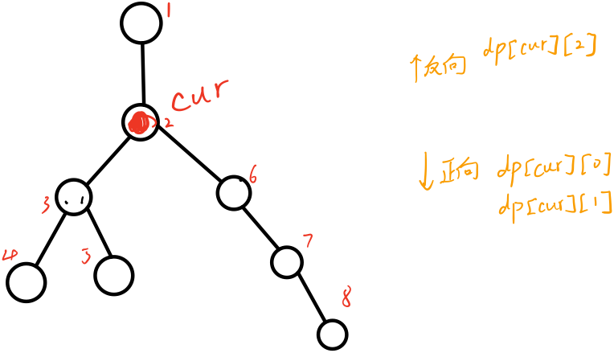

;commend line : pandoc "HDU 2196.md" -o "./HDU 2196.pdf" --pdf-engine=xelatex --toc --toc-depth=4 --from markdown --template eisvogel --listings
; in mac if user snippts of markdown don't work , tap option + Esc

# HDU 2196
[链接](http://acm.hdu.edu.cn/showproblem.php?pid=2196)
题意：n个结点和的带权边组成的树，求树上每一结点到其他结点的距离的最大值。

## 一个正确思路（树上dp）
一般的树上dp可以处理的就是类似这种树上最值问题，但是一般的树上dp往往只是单向处理，即从树根到叶子这个方向去记录状态转移，但是对于这一题，显然我们需要考虑两个方向，一个是 以当前结点作为树根的子树 方向，另一个就是 总的树上不包含以当前结点作为树根的子树 方向。用数学语言描述如下：
设当前结点为：$v_i$，对于全结点集合有$v_i \in V$，假设树为$T$，以当前结点为树根的子树$t_i \subset T$。则在进行状态转移时，我们应当同时考虑$v_j \in t_i$ 和 $v'_j \in T / t_i$分别到结点$i$的最远距离。

为了达到同时考虑两个方向的情况，显然我们可以进行两次dfs，分别记录两个方向的状态，并进行状态转移。

对于代码中反向结点状态转移这里给出解释：
假设当前结点为cur，考虑计算6的反向状态转移，显然结点6的状态转移应该由cur的反向和cur的部分正向（即cur子树中不包括结点6的那一部分）组成，通常来说，这个状态转移方程如下：
$$dp[6][2] = max(dp[cur][0],dp[cur][2]) + w$$ 
$dp[cur][0]$代表子树到达cur的最远距离，然鹅在这个例子我们发现结点6恰好就在cur取得$dp[cur][0]$的路上，显然不符合结点6反向状态转移方程的组成，因此我们需要一个次最大距离，在这里次最大距离指向3结点的方向，不在6结点方向上，则可以安心状态转移。
因此总的反向状态转移方程如下：
$$dp[v][2] = \begin{cases}
    max(dp[cur][0],dp[cur][2]) + w      & id[cur]!=v \\
    max(dp[cur][1],dp[cur][2]) + w      & id[cur]==v
\end{cases}$$
id数组存储取得最大距离的结点。
细节见代码：
```cpp
/*
*   author : charlemagnescl 
*   problem name: HDU 2196
*   solveing date : 2020.7.7
*   tag: dp on Tree
*/
#include <iostream>
#include <cstdio>
#include <cstring>
#include <set>
#include <cstdio>
#include <algorithm>
#include <queue>
#include <vector>
using namespace std;
typedef long long LL;
const int N = 1e4+100;
int head[N],tot,id[N];
LL dp[N][3];
struct node
{
    int to,next;
    LL w;
    node(){}
    node(int t,LL l,int n):to(t),w(l),next(n){}
}e[N<<1];
void add(int u,int v,LL w)
{
    e[tot] = node(v,w,head[u]);
    head[u]=tot++;
}
void dfs1(int cur,int pre)  // 记录以cur为根的子树状态（正向）
{
    for(int i=head[cur];i!=-1;i=e[i].next)
    {
        int v = e[i].to;
        LL w=e[i].w;
        if(v!=pre)
        {
            dfs1(v,cur);
            LL x = dp[v][0] + w;
            if(x>dp[cur][0])    // 记录最大距离
            {
                dp[cur][0]=x;
                id[cur] = v;    // 记录取得最大距离的路径
            }
        }
    }
    for(int i=head[cur];i!=-1;i=e[i].next)
    {
        int v = e[i].to;
        LL w=e[i].w;
        if(v!=pre && v!=id[cur])    // 记录次最大距离
        {
            dfs1(v,cur);
            LL x = dp[v][0] + w;
            if(x>dp[cur][1])
            {
                dp[cur][1]=x;
            }
        }
    }
}
void dfs2(int cur, int pre)     // 记录反方向的状态转移
{

    for(int i=head[cur]; i!=-1; i=e[i].next)
    {
        int v = e[i].to;
        LL w = e[i].w;
        if(v!=pre)
        {
            if(id[cur] == v)    
                                
            {
                dp[v][2] = max(dp[cur][1],dp[cur][2]) + w;
            }
            else
            {
                dp[v][2] = max(dp[cur][0],dp[cur][2]) + w;
            }
            dfs2(v,cur);
        }
    }
}
int main()
{
    int n;
    while(~scanf("%d",&n))
    {
        memset(head,-1,sizeof(head));
        memset(dp,0,sizeof(dp));
        tot=0;
        for(int i=2;i<=n;i++)
        {
            int v;
            LL w;
            scanf("%d%lld",&v,&w);
            add(i,v,w);
            add(v,i,w);
        }
        dfs1(1,0);
        dfs2(1,0);
        for(int i=1;i<=n;i++)
        {
            printf("%lld\n",max(dp[i][2],dp[i][0]));    // 结果取两个方向的较大值
        }
    }
    return 0;
}
```


